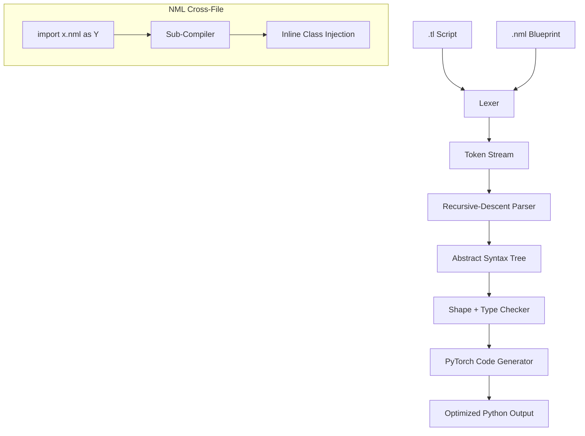

# TensorLoom

**A GPU-Efficient Domain-Specific Language for AI Training**

[](tests/)
[](https://python.org)
[](https://pytorch.org)
[](LICENSE)

TensorLoom is a high-performance, domain-specific programming language designed from the ground up for deep learning training workloads. It compiles to optimized PyTorch code with automatic mixed precision, kernel fusion, distributed training, and custom GPU kernels — all without boilerplate.

---

## Key Architectural Advantages

- **Declarative / Imperative Split** — Model architectures in `.nml`, execution pipelines in `.tl`
- **Auto-Fused Pipeline Flow** — The pipe operator (`|>`) desugars into nested operations optimized by `torch.compile(mode="max-autotune")`
- **Zero-Boilerplate Scaling** — One `distributed = true` flag generates a complete 145-line DDP system
- **Inline Accelerator Blocks** — Drop into custom tiled GPU code with `@kernel` Triton syntax
- **Compile-Time Verification** — Shape inference catches dimension mismatches in milliseconds

---

## Quick Start

### 1. Install TensorLoom

```bash
git clone https://github.com/youruser/tensorloom.git
cd tensorloom
pip install -e ".[dev]"
```

### 2. Verify the test suite

```bash
python -m pytest tests/ -v
# 247 tests passed
```

### 3. Compile and run your first model

```bash
tlc compile examples/mnist.tl -o run.py
python run.py
```

### 4. Inspect model parameters before training

```bash
tlc info examples/mnist.tl
```

---

## Language Reference

### `.tl` — Imperative Execution Scripts

```
// Define a model
model Net:
    layer fc1 = Linear(784, 128)
    layer fc2 = Linear(128, 10)
    fn forward(self, x: Tensor) -> Tensor:
        return x |> self.fc1 |> relu |> self.fc2

// Load data and train
let net = Net()
let data = load_dataset()

train net on data:
    epochs = 10
    optimizer = Adam(lr=0.001)
    loss = CrossEntropy
    precision = fp16
```

### `.nml` — Declarative Architecture Blueprints

```
@model TransformerBlock:
    @config:
        d_model = 512
        n_heads = 8

    @layers:
        attention = MultiHeadAttention(d_model, n_heads)
        norm1 = LayerNorm(d_model)
        ff = Linear(d_model, d_model)

    @forward(x):
        let residual = x
        x = norm1(x)
        x = residual + attention(x)
        x = ff(x)
        return x
```

### Cross-File Imports

```
// train.tl — import .nml architecture into .tl pipeline
import transformer.nml as MyBlock

let net = MyBlock(d_model=256, n_heads=4)  // override config defaults
let data = load_dataset()

train net on data:
    epochs = 20
    optimizer = Adam(lr=0.0001)
    precision = fp16
```

### Inline GPU Kernels

```
@kernel def vector_add(x_ptr, y_ptr, z_ptr, n, BLOCK: tl.constexpr):
    let pid = tl.program_id(axis=0)
    let offsets = pid * BLOCK + tl.arange(0, BLOCK)
    let mask = offsets < n
    let x = tl.load(x_ptr + offsets, mask=mask)
    let y = tl.load(y_ptr + offsets, mask=mask)
    tl.store(z_ptr + offsets, x + y, mask=mask)
```

Compiles to `@triton.jit` kernel + auto-generated launcher with `triton.cdiv` grid calculation.

---

## Feature Matrix

| Feature | What It Does | How It Works |
|---------|-------------|-------------|
| **Kernel Fusion** | Combines operations for fewer GPU kernel launches | `torch.compile(mode="max-autotune")` |
| **Mixed Precision** | Trains in FP16 with loss scaling | `autocast` + `GradScaler` |
| **Auto Device** | Routes tensors to GPU/CPU automatically | CUDA detection at startup |
| **Shape Inference** | Catches dimension mismatches at compile time | Rule-based propagation engine |
| **Activation Checkpointing** | Trades compute for ~60% less memory | `torch.utils.checkpoint` with `_forward_body` |
| **Distributed (DDP)** | Multi-GPU training from a single flag | `setup_ddp` + `DistributedSampler` + rank-gating |
| **Triton Kernels** | Custom GPU code inline in `.tl` | `@kernel` to `@triton.jit` + auto-launcher |
| **NML Models** | Declarative architecture specifications | `@model/@config/@layers/@forward` to `nn.Module` |
| **Cross-File Imports** | Modular architecture-from-file system | `import path.nml as Alias` with sub-compilation |
| **Pipe Operator** | Functional composition syntax | `x \|> f \|> g` desugars to `g(f(x))` |
| **Memory Profiling** | Parameter counting before training | `tlc info` command |
| **Dropout Flags** | Correct train/eval behavior | `training=self.training` auto-injection |

---

## Compiler Architecture



---

## Examples Gallery

| Architecture | NML Blueprint | Training Script | Features Showcased |
|-------------|--------------|----------------|-------------------|
| **MNIST CNN** | — | [`mnist.tl`](examples/mnist.tl) | Model def, train block, AMP |
| **ResNet Block** | [`resnet.nml`](examples/resnet.nml) | [`train_resnet.tl`](examples/train_resnet.tl) | Residual connections, cross-file import, checkpointing |
| **LSTM Seq2Seq** | [`lstm_seq2seq.nml`](examples/lstm_seq2seq.nml) | [`train_lstm.tl`](examples/train_lstm.tl) | Multi-layer RNN, configurable vocab |
| **Vision Transformer** | [`vision_transformer.nml`](examples/vision_transformer.nml) | [`train_vit.tl`](examples/train_vit.tl) | Patch embedding, attention, AMP + checkpointing |
| **Transformer Block** | [`transformer.nml`](examples/transformer.nml) | [`train_transformer.tl`](examples/train_transformer.tl) | Full NML config system, cross-file import |
| **Triton Kernel** | — | [`vector_add.tl`](examples/vector_add.tl) | Inline GPU kernel compilation |

---

## CLI Commands

```bash
tlc compile <file.tl>              # Transpile to Python
tlc compile <file.tl> -o out.py    # Transpile with custom output path
tlc run <file.tl>                  # Compile and execute immediately
tlc check <file.tl>                # Type-check and validate without executing
tlc info <file.tl>                 # Show estimated GPU memory usage
tlc tokens <file.tl>               # Debug: dump token stream
tlc ast <file.tl>                  # Debug: dump AST
```

---

## Project Structure

```
tensorloom/
    src/tensorloom/
        lexer/          # Hand-written lexer with 30+ token types
        parser/         # Recursive-descent parser + AST nodes
        codegen/        # PyTorch backend code generator
        analyzer/       # Shape inference + type checker
        runtime/        # Tensor operations library
        cli.py          # tlc command-line driver
    examples/           # .tl and .nml reference implementations
    tests/              # 247+ comprehensive test suite
```

---

## License

MIT License. See [LICENSE](LICENSE) for details.
