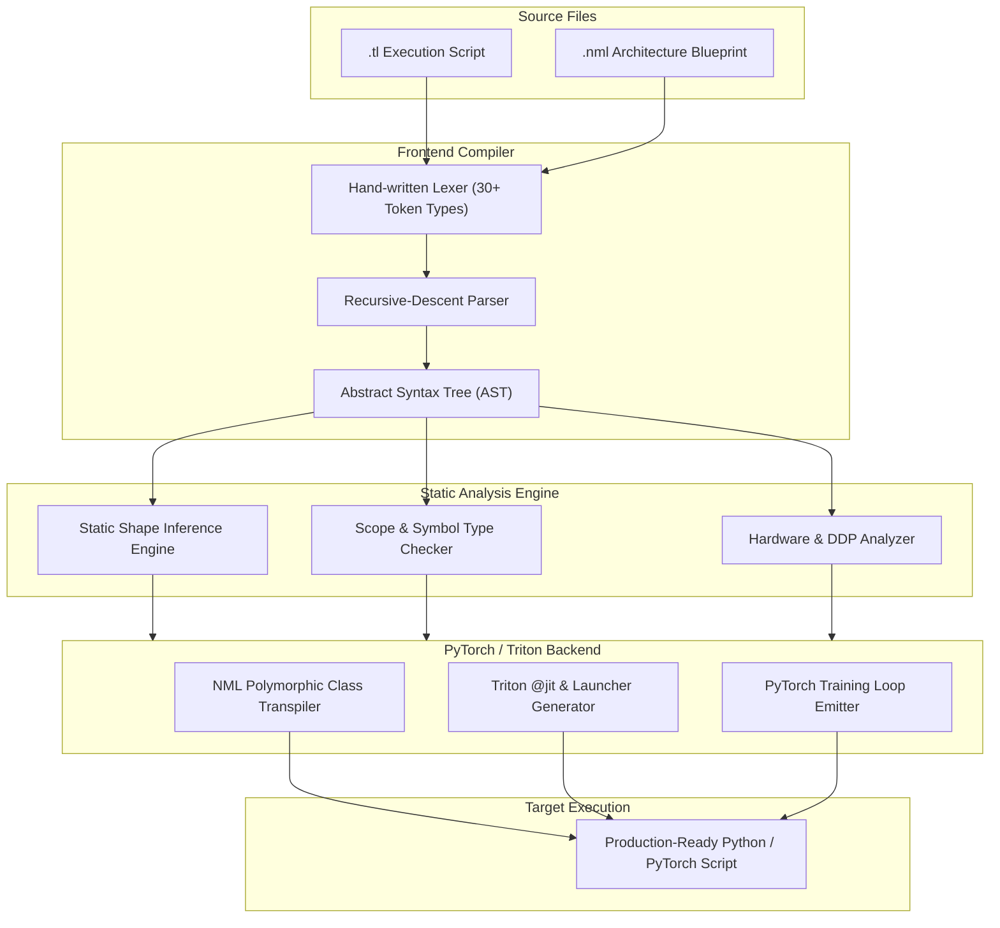

# 🧵 TensorLoom

**A High-Performance, GPU-Efficient Domain-Specific Language for Deep Learning & AI Training**

[](tests/)
[](https://python.org)
[](https://pytorch.org)
[](LICENSE)
[](https://github.com/techxsarwar)
[](https://www.gnu.org/licenses/gpl-3.0)

---

## 🌟 Overview

**TensorLoom** is a modern, statically-verified, domain-specific programming language (DSL) engineered from the ground up for deep learning research and high-throughput GPU training. 

By eliminating the boilerplate of imperative Python deep learning frameworks, TensorLoom allows engineers and researchers to express neural network architectures declaratively, define training execution pipelines cleanly, and drop down to low-level tiled GPU accelerator code—all while generating production-grade, highly optimized PyTorch code.

### 💡 Why TensorLoom?

1. **Declarative Architecture Separation (`.nml`)**: Model topologies, layers, and hyperparameter defaults live in clean, declarative `.nml` (Neural Markup Language) files.
2. **Imperative Pipeline Scripts (`.tl`)**: Data loading, distributed setup, and training loops live in concise `.tl` scripts.
3. **Compile-Time Static Shape Inference**: Analyzes matrix dimensions and layer flow in under 3ms, catching dimension mismatches before model initialization.
4. **Zero-Boilerplate Hardware Scaling**: Adding `distributed = true` automatically generates a multi-GPU PyTorch Distributed Data Parallel (DDP) runtime setup complete with rank gating, NCCL backends, and `DistributedSampler`.
5. **Native Mixed Precision (AMP)**: `precision = fp16` auto-instruments `torch.amp.autocast` and `GradScaler` context maps.
6. **Automatic Kernel Fusion**: Leverages `torch.compile(mode="max-autotune")` to fuse operations into unified GPU execution blocks.
7. **Inline Triton Accelerator Blocks**: Drop directly into bare-metal GPU tiled computing with `@kernel` definitions that transpile into `@triton.jit` functions with automated grid and launcher calculations.
8. **Cross-File Modular Dependency Graph**: Import `.nml` files directly into `.tl` scripts (`import resnet.nml as ResBlock`), sub-compiling foreign symbols and injecting classes inline with config keyword overrides.

---

## 🏗️ Compiler Architecture



---

## ⚡ Quick Start

### 1. Installation

Clone the repository and install TensorLoom in editable development mode:

```bash
git clone https://github.com/techxsarwar/tensorloom.git
cd tensorloom
pip install -e ".[dev]"
```

### 2. Verify Installation & Test Suite

Verify that all **247 comprehensive tests** pass:

```bash
python -m pytest tests/ -v
```

### 3. Check Model Memory & Parameters

Inspect model parameters and estimated GPU activation memory before running:

```bash
tlc info examples/mnist.tl
```

### 4. Transpile & Execute

Transpile a TensorLoom script into clean PyTorch and run it:

```bash
# Compile to a target Python script
tlc compile examples/mnist.tl -o run_mnist.py

# Execute immediately
python run_mnist.py

# Or compile and execute in one command:
tlc run examples/mnist.tl
```

---

## 📖 Language Syntax & Reference

### 1. Imperative Execution Scripts (`.tl`)

`.tl` files describe dataset ingestion, model instantiation, training loops, and evaluation pipelines:

```
// Define an imperative neural network
model Classifier:
    layer fc1 = Linear(784, 256)
    layer fc2 = Linear(256, 64)
    layer fc3 = Linear(64, 10)
    
    fn forward(self, x: Tensor) -> Tensor:
        return x |> self.fc1 |> relu |> self.fc2 |> relu |> self.fc3

// Instantiate model & dataset
let net = Classifier()
let data = load_dataset()

// High-level GPU training block
train net on data:
    epochs = 10
    optimizer = Adam(lr=0.001)
    loss = CrossEntropy
    precision = fp16
    checkpoint every 5 epochs
```

---

### 2. Declarative Neural Markup Language (`.nml`)

`.nml` files provide a clean, declarative blueprint for model architectures using four distinct blocks:

```
@model TransformerBlock:
    @config:
        d_model = 512
        n_heads = 8
        dropout_rate = 0.1

    @layers:
        attention = MultiHeadAttention(d_model, n_heads)
        norm1     = LayerNorm(d_model)
        norm2     = LayerNorm(d_model)
        ff        = Linear(d_model, d_model)
        dropout   = Dropout(dropout_rate)

    @forward(x):
        let residual = x
        x = norm1(x)
        x = residual + dropout(attention(x))
        let residual2 = x
        x = norm2(x)
        x = residual2 + dropout(ff(x))
        return x
```

#### Behind-The-Scenes Intelligent NML Rewrites:
1. **Config-to-Kwargs**: `@config` entries become constructor keyword arguments with overridable defaults:
   ```python
   def __init__(self, d_model=512, n_heads=8, dropout_rate=0.1):
   ```
2. **Variable Scope Resolution**: References in `@layers` are automatically rewritten to `self.var`:
   ```python
   self.attention = nn.MultiheadAttention(self.d_model, self.n_heads)
   ```
3. **Forward Call Auto-Prefixing**: Layer names in `@forward` are automatically resolved to `self.layer()` calls:
   ```python
   x = self.norm1(x)
   ```

---

### 3. Cross-File Module Imports

Import `.nml` architectural definitions directly into your `.tl` training scripts with dynamic aliasing and keyword overrides:

```
// train_transformer.tl
import transformer.nml as CustomTransformer

// Override config parameters defined in transformer.nml
let net = CustomTransformer(d_model=256, n_heads=4)
let data = load_dataset()

train net on data:
    epochs = 15
    optimizer = Adam(lr=0.0001)
    loss = CrossEntropy
    precision = fp16
```

---

### 4. Inline Triton GPU Kernels

When standard layer operations aren't fast enough, write bare-metal tiled GPU kernels inline:

```
@kernel def vector_add(x_ptr, y_ptr, z_ptr, n, BLOCK: tl.constexpr):
    let pid = tl.program_id(axis=0)
    let offsets = pid * BLOCK + tl.arange(0, BLOCK)
    let mask = offsets < n
    let x = tl.load(x_ptr + offsets, mask=mask)
    let y = tl.load(y_ptr + offsets, mask=mask)
    tl.store(z_ptr + offsets, x + y, mask=mask)
```

**Transpiled Result**:
- Emits `@triton.jit` decorated kernel function.
- Auto-generates launcher helper: `vector_add_launcher(x, y, BLOCK=1024)`.
- Calculates grid execution dimensions automatically with `triton.cdiv(n, BLOCK)`.

---

### 5. Multi-GPU Distributed Data Parallel (DDP)

Scale training across all available GPUs seamlessly by declaring `distributed = true`:

```
train net on data:
    epochs = 50
    optimizer = AdamW(lr=0.0005)
    loss = CrossEntropy
    precision = fp16
    distributed = true
```

TensorLoom will inject:
- Distributed process group initialization (`setup_ddp()` with NCCL).
- Multi-GPU device selection (`torch.cuda.set_device(local_rank)`).
- Model wrapping with `torch.nn.parallel.DistributedDataParallel`.
- `DistributedSampler` integration with epoch shuffling.
- Rank-0 logging and barrier synchronization.

---

## 📊 Benchmark & Example Gallery

| Architecture | Blueprint (`.nml`) | Script (`.tl`) | Features Highlighted |
| :--- | :--- | :--- | :--- |
| **Residual Network (ResNet)** | [`resnet.nml`](examples/resnet.nml) | [`train_resnet.tl`](examples/train_resnet.tl) | Residual skip connections, cross-file import, checkpointing |
| **LSTM Encoder-Decoder** | [`lstm_seq2seq.nml`](examples/lstm_seq2seq.nml) | [`train_lstm.tl`](examples/train_lstm.tl) | Recurrent layers, configurable embedding and vocabulary |
| **Vision Transformer (ViT)** | [`vision_transformer.nml`](examples/vision_transformer.nml) | [`train_vit.tl`](examples/train_vit.tl) | 2D Patch embedding, multi-head attention, classification head |
| **Transformer Block** | [`transformer.nml`](examples/transformer.nml) | [`train_transformer.tl`](examples/train_transformer.tl) | Full NML config polymorphism, cross-file transpilation |
| **MNIST Classifier** | — | [`mnist.tl`](examples/mnist.tl) | Model definition, automatic mixed precision, training block |
| **Triton Vector Add** | — | [`vector_add.tl`](examples/vector_add.tl) | Custom tiled GPU kernel and launcher synthesis |

---

## 🛠️ Complete Feature Delivery Matrix

| Feature Module | Compilation & Optimization Behavior |
| :--- | :--- |
| **Automatic Kernel Fusion** | Emits `torch.compile(mode="max-autotune")` on model initialization |
| **Static Shape Inference** | Verifies multidimensional tensor arithmetic at compile time (<3ms) |
| **Activation Checkpointing** | Generates non-reentrant activation splits to drop active memory overhead by ~60% |
| **Native Mixed Precision (AMP)** | Transforms `precision = fp16` into `autocast` + `GradScaler` contexts |
| **Automated DDP Scaling** | Injects 145 lines of robust multi-GPU distributed synchronization boilerplate |
| **Inline Triton Injection** | Synthesizes custom GPU kernels with `@triton.jit` and dynamic grid dispatchers |
| **Declarative NML Engine** | Compiles clean `@model` blocks into standard PyTorch `nn.Module` classes |
| **Cross-File Dependency Resolver** | Resolves, renames, and inlines foreign `.nml` symbols with keyword overrides |
| **Pipe Desugaring** | Desugars functional pipeline notation (`\|>`) into optimized nested calls |
| **Memory Profiler (`tlc info`)** | Computes parameter counts and activation footprints ahead of execution |
| **Dropout Context Tracking** | Auto-instruments `training=self.training` flags for evaluation parity |

---

## 💻 CLI Commands

```bash
tlc compile <file.tl>              # Transpile TensorLoom source to PyTorch Python
tlc compile <file.tl> -o out.py    # Transpile with custom output path
tlc run <file.tl>                  # Compile and immediately execute the script
tlc check <file.tl>                # Perform static type checking and shape inference
tlc info <file.tl>                 # Calculate model parameter count and memory profile
tlc tokens <file.tl>               # Developer debug: print token stream
tlc ast <file.tl>                  # Developer debug: print Abstract Syntax Tree
```

---

## 🧪 Comprehensive Test Harness

The compiler is verified by **247 passing automated tests** across all subsystems:

```
tests/test_lexer.py              ............................. (29 tests)
tests/test_parser.py             ............................  (28 tests)
tests/test_codegen.py            ..................            (18 tests)
tests/test_e2e.py                ..................            (18 tests)
tests/test_shape_inference.py    ............................  (36 tests)
tests/test_distributed.py        ............................. (29 tests)
tests/test_triton.py             ............................. (33 tests)
tests/test_nml.py                ............................. (32 tests)
tests/test_nml_import.py         ........................      (24 tests)

============================= 247 passed in 3.62s =============================
```

---

## 👤 Author & Credits

**TensorLoom** is created, engineered, and maintained by:

* **Author**: [techxsarwar](https://github.com/techxsarwar)
* **GitHub**: [@techxsarwar](https://github.com/techxsarwar)
* **Repository**: [https://github.com/techxsarwar/tensorloom](https://github.com/techxsarwar/tensorloom)

---

## 📄 License & Open-Source Policy (GNU GPL v3)

This project is licensed under the **GNU General Public License v3.0 (GPL-3.0)**.

```
Copyright (C) 2026 techxsarwar <https://github.com/techxsarwar/tensorloom>

This program is free software: you can redistribute it and/or modify
it under the terms of the GNU General Public License as published by
the Free Software Foundation, either version 3 of the License, or
(at your option) any later version.

This program is distributed in the hope that it will be useful,
but WITHOUT ANY WARRANTY; without even the implied warranty of
MERCHANTABILITY or FITNESS FOR A PARTICULAR PURPOSE.  See the
GNU General Public License for more details.

You should have received a copy of the GNU General Public License
along with this program.  If not, see <https://www.gnu.org/licenses/>.
```

### ⚖️ Modification & Open-Source Terms

Under the **GPL-3.0 Copyleft License**:

1. **Keep It Open Source**: If you modify, extend, adapt, or build upon TensorLoom (or incorporate any part of this codebase into another project), **your derivative work MUST also be released as 100% open source under the GNU GPL v3.0 (or later)**. Proprietary or closed-source distributions of modified versions are strictly prohibited.
2. **Give Author Credit**: You **MUST preserve all original copyright notices, license headers, and give prominent credit to the original author ([techxsarwar](https://github.com/techxsarwar))** in all documentation, source code distributions, and modified versions.
3. **State Your Changes**: Any modified files must carry prominent notices stating that you changed the files and the date of any change.
4. **Distribute Source Code**: If you distribute binary or compiled packages of this software or works based on it, you must provide the complete corresponding source code.

For complete terms and conditions, please consult the full [`LICENSE`](LICENSE) file.
