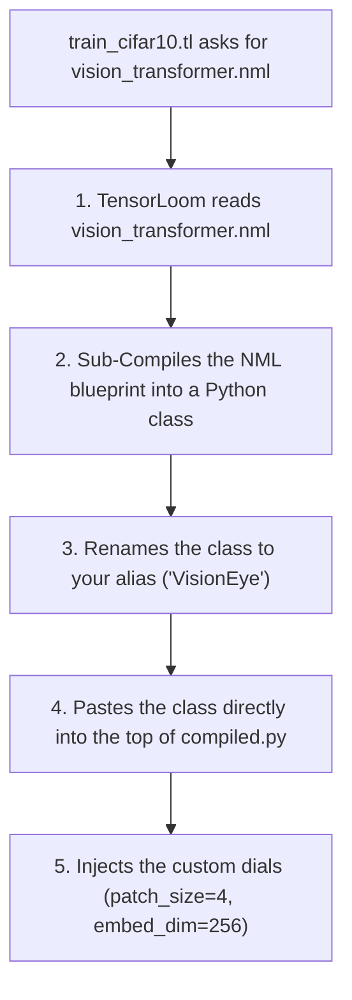

# 📦 Guide 05: The LEGO Toy Box (Cross-File Modular Architecture)

> *Imagine you built an awesome LEGO dragon head in one room. If your friend in the next room is building a castle, they shouldn't have to rebuild your dragon from scratch! They should just say: "Hey, send the dragon head over, and I'll plug it onto my castle wall!" That is what Cross-File Imports do.*

---

## 📂 The Clean AI Project Folder

When building big AI projects, you don't dump 5,000 lines of code into a single giant text file. You organize your files into neat little boxes:

```
my_ai_lab/
├── models/                      📁 The Blueprint Box (.nml)
│   ├── resnet_block.nml         ➔ A tough convolutional block
│   └── vision_transformer.nml   ➔ A super-smart vision eye
│
└── experiments/                 📁 The Training Gym (.tl)
    ├── train_cifar10.tl         ➔ Trains on picture flashcards
    └── train_imagenet.tl        ➔ Trains on big photo albums
```

---

## 🔌 How to Import and Plug In a Model

In your training script (`train_cifar10.tl`), you bring in an `.nml` blueprint using `import ... as ...`:

```
// 1. Fetch the blueprint from the models folder and call it "VisionEye"
import models.vision_transformer.nml as VisionEye

// 2. Build one, but customize the dials for our smaller pictures!
let net = VisionEye(patch_size=4, embed_dim=256, num_heads=8)

// 3. Load our practice cards
let data = load_dataset()

// 4. Train it!
train net on data:
    epochs = 15
    optimizer = Adam(lr=0.0003)
    loss = CrossEntropy
    precision = fp16
```

---

## 🤖 What TensorLoom Does Behind the Scenes

When you run `python -m tensorloom compile train_cifar10.tl -o compiled.py`, the compiler does a 4-step dance:



### Why This is Amazing:
1. **Single Self-Contained Output**: The generated `compiled.py` has zero external dependencies on other files. You can email that single `.py` file to a friend, send it to a supercomputer cluster, or deploy it on AWS, and it will run flawlessly!
2. **Dynamic Aliasing**: If two blueprints have the same name (like `Block`), you can import one as `ResBlock` and another as `TransformerBlock` without any naming collisions.
3. **Compile-Time Checks**: If `vision_transformer.nml` has a typo or is missing, TensorLoom catches it before compiling the rest of your program.
