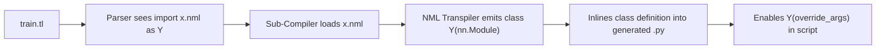

# 📦 Guide 05: Cross-File Modular Architecture

TensorLoom bridges declarative architecture design and imperative pipeline execution through its **Cross-File Import System**.

---

## 1. Project Organization

A standard TensorLoom project maintains a clean separation between architecture blueprints and training pipelines:

```
my_project/
├── architectures/
│   ├── resnet.nml
│   ├── transformer.nml
│   └── vit.nml
└── pipelines/
    ├── train_classification.tl
    └── evaluate.tl
```

---

## 2. The Import Statement Syntax

To import an `.nml` architecture file into a `.tl` script, use the `import ... as ...` syntax:

```
import architectures.resnet.nml as ResNet
import architectures.transformer.nml as MyTransformer
```

---

## 3. How Cross-File Sub-Compilation Works



1. When the compiler encounters `import path.nml as Alias`, it pauses top-level code generation.
2. It locates and parses the external `.nml` file relative to the source directory.
3. It sub-compiles the `.nml` model and renames the resulting Python class to the specified `Alias`.
4. It injects the full `nn.Module` class inline into the output Python file before any instantiation.

---

## 4. End-to-End Cross-File Example

### File 1: `resnet.nml`
```
@model ResBlock:
    @config:
        channels = 64

    @layers:
        conv1 = Conv2d(channels, channels, kernel_size=3, padding=1)
        bn1   = BatchNorm2d(channels)

    @forward(x):
        let residual = x
        x = relu(bn1(conv1(x)))
        return x + residual
```

### File 2: `train_resnet.tl`
```
import resnet.nml as ResBlock

// Instantiate with custom config override
let net = ResBlock(channels=128)
let data = load_dataset()

train net on data:
    epochs = 10
    optimizer = Adam(lr=0.001)
    loss = CrossEntropy
    precision = fp16
```

### Compile Command:
```bash
python -m tensorloom compile train_resnet.tl -o train_resnet_compiled.py
```
