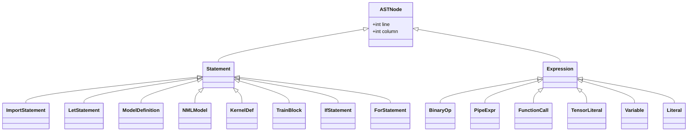

# 📘 Module 01: Language Fundamentals & Grammar

This module provides the formal specification of TensorLoom’s lexical structure, type system, statement grammar, scoping rules, and Abstract Syntax Tree (AST) hierarchy.

---

## 1. Lexical Grammar & Token System

The TensorLoom lexer is a deterministic, hand-written scanner (`src/tensorloom/lexer/lexer.py`) designed for zero-copy string slicing and high token throughput.

### 1.1 Token Types (Categorized)

```
Literals:      INTEGER, FLOAT, STRING, BOOLEAN
Identifiers:   IDENTIFIER (variables, function names, types)
Keywords:      LET, MODEL, LAYER, FN, RETURN, TRAIN, ON, IMPORT, AS,
               IF, ELSE, FOR, IN, CHECKPOINT, EVERY, EPOCHS, DISTRIBUTED
NML Decorators: AT_MODEL (@model), AT_CONFIG (@config), AT_LAYERS (@layers), 
               AT_FORWARD (@forward), AT_KERNEL (@kernel)
Operators:     PLUS (+), MINUS (-), STAR (*), SLASH (/), MATMUL (@), 
               PIPE (|>), EQUALS (=), EQEQ (==), NEQ (!=), LT (<), 
               LTE (<=), GT (>), GTE (>=)
Delimiters:    LPAREN ((), RPAREN ()), LBRACKET ([), RBRACKET (]), 
               COLON (:), COMMA (,), DOT (.), ARROW (->), NEWLINE, INDENT, DEDENT
```

### 1.2 Indentation and Block Scope Rules
TensorLoom uses Python-style off-side rule indentation scoping:
- Indentation increases emit an `INDENT` token.
- Indentation decreases emit one or more `DEDENT` tokens matching previous indentation levels.
- Tabs and spaces are normalized (4 spaces standard).

---

## 2. Formal Statement Grammar (EBNF)

```ebnf
Program         ::= Statement*

Statement       ::= ImportStmt
                  | LetStmt
                  | ModelDef
                  | NMLModel
                  | KernelDef
                  | TrainBlock
                  | IfStmt
                  | ForStmt
                  | ExprStmt

ImportStmt      ::= "import" DottedPath ("as" IDENTIFIER)? NEWLINE
DottedPath      ::= IDENTIFIER ("." IDENTIFIER)*

LetStmt         ::= "let" IDENTIFIER ("=" Expression)? NEWLINE

ModelDef        ::= "model" IDENTIFIER ":" NEWLINE INDENT ModelBody DEDENT
ModelBody       ::= (LayerDecl | FnDef)*
LayerDecl       ::= "layer" IDENTIFIER "=" LayerInst NEWLINE
LayerInst       ::= IDENTIFIER "(" ArgList? ")"

FnDef           ::= "fn" IDENTIFIER "(" ParamList? ")" ("->" TypeAnnotation)? ":" NEWLINE INDENT StmtList DEDENT
```

---

## 3. Type System & Type Annotations

TensorLoom supports static type annotations for functions and tensor shapes:

```
// Primitive Types
let learning_rate: Float = 0.001
let batch_size: Int = 64
let device_name: String = "cuda:0"
let is_training: Bool = true

// Tensor Types with Shape Signatures
fn forward(self, x: Tensor[Batch, 3, 224, 224]) -> Tensor[Batch, 1000]:
    return x |> self.backbone |> self.classifier
```

---

## 4. Operator Precedence Table

Operators are evaluated according to the following precedence hierarchy (from lowest to highest):

| Level | Operator | Description | Associativity |
| :---: | :---: | :--- | :---: |
| **1** | `\|>` | Functional Pipe Operator | Left-to-right |
| **2** | `=` | Assignment | Right-to-left |
| **3** | `==`, `!=`, `<`, `<=`, `>`, `>=` | Comparison Operators | Non-associative |
| **4** | `+`, `-` | Additive Arithmetic | Left-to-right |
| **5** | `*`, `/`, `@` | Multiplicative & Matrix Multiply | Left-to-right |
| **6** | `.` | Member Access & Method Call | Left-to-right |
| **7** | `(...)`, `[...]` | Grouping, Function Call, Indexing | Left-to-right |

---

## 5. AST Node Hierarchy

Every statement and expression in a TensorLoom program is parsed into a strongly-typed dataclass extending `ASTNode` (`src/tensorloom/parser/ast_nodes.py`):



### AST Dataclass Representation (Excerpt):
```python
@dataclass
class LetStatement(Statement):
    name: str
    type_annotation: Optional[str] = None
    value: Optional[Expression] = None

@dataclass
class PipeExpr(Expression):
    left: Expression
    right: Expression  # Function or LayerCall target
```
